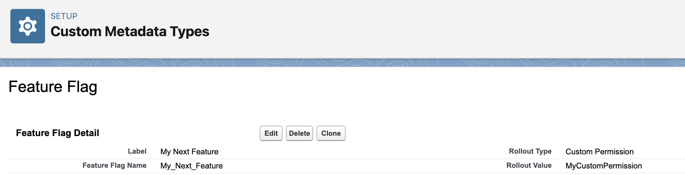

# Feature Flagging Framework
## Deploy Salesforce features according to your pace  
A lightweight, extensible **Feature Flagging Framework** for Salesforce that allows controlled rollouts, gradual deployments, and easy management of feature toggles.  

---
## 🚀 Key Features
-  Simple Facade interface to check if a feature is active
-  Pluggable evaluation logic (by role, profile, user, org, etc.)
-  In-memory cache to avoid redundant queries
-  Test-friendly with easy stubbing/mocking
-  Open-Closed design — extend logic without modifying base classes
---
## 📌 How To Use?  
1️⃣ **Create a New Feature Flag Record in Feature_Flag__mdt**  
2️⃣ **Call Framework**
```java
Feature.isActive(String FeatureName);
```
3️⃣ **Sit back and observe your feature rolling out according to you ✅**   
#### ⚠️ Behavior on Invalid Flags  
This framework acts like a **black box** — it won’t throw errors to your code.  
If something goes wrong internally, it simply returns `false`.  
That means:
- ❌ Invalid Feature Name → `false`  
- ❌ Missing or Misconfigured Rollout Strategy → `false`  
- ❌ Any Internal Exception → `false`    
`All such issues are logged in debug logs, making it easy to trace and fix them during testing.`
`No exceptions are thrown or leaked — keeping production flow safe and stable.`
---
## ⚒️ Creating New Feature Flag  
📍 Navigate to:
```Setup --> Custom Metadata --> Feature Flag --> Manage Records --> New ``` 
| Field | Value |
| ------ | ------ |
| Label | Feature Name(Without special characters) |
| Feature Flag Name | Feature_Name(Auto Populated) |
| Rollout Type | Type of rollout for feature |
| Rollout value | Additional value to evaluate status |   

  

#### 🧭  Values Map  
| ⚙️ Rollout Type | 📥 Rollout Value |
| ------ | ------ |
| Enabled | Null |
| Disabled | Null |
| Custom Permission | Custom Permission Name |
---
## ❓Why This Framework?  
Managing feature rollouts in Salesforce often involves **custom labels** or **custom settings**, requiring manual updates and cluttering the org with unnecessary entries. This framework provides:  

✔ **Scalability** – Add new feature types **without modifying core logic**  
✔ **Extensibility** – Define **custom rollout strategies**  
✔ **Performance** – **Cached evaluations** for better efficiency  
✔ **Maintainability** – Follows **SOLID principles** for clean and structured code  
✔ **Devops Friendly** – Metadata Driven architecture makes it **deployable using metadata api & CI/CD pipelines**
---

## 🧰 Design Patterns Used  
| Pattern          | Purpose                                                                 |
|------------------|-------------------------------------------------------------------------|
| **Facade**      | Expose a clean API to consumers without exposing internal logic using [Feature Class ](force-app/main/default/classes/Feature.cls)
| |```Feature.isActive(String FeatureName);```     |
| **Strategy**     | Evaluate feature flags using different strategies (e.g. [enabled](force-app/main/default/classes/FeatureType_Enabled.cls), [disabled](force-app/main/default/classes/FeatureType_Disabled.cls), [custom permissions](force-app/main/default/classes/FeatureType_CustomPermission.cls), etc.)  |
| **Factory**      | Dynamically load the right evaluation strategy using [FeatureTypeFactory Class](force-app/main/default/classes/FeatureTypeFactory.cls) |
| **Caching**      | In-memory cache for performance using [FeatureFlag Class](force-app/main/default/classes/FeatureFlag.cls) |
| **Separation of Concerns** | Keeps evaluation logic, cache, and exposure layers decoupled  |

---
## 🔄  Current Rollout Strategies  
✅ **Enabled** –  Global ON
✅ **Disabled** –  Global OFF
✅ **Custom Permission-Based** – Checks if a user has a custom permission 
---
## 🧪 Planned Rollout Strategies
🔜 **Profile-Based Rollout** – Target specific user profiles
🔜 **Role-Based Rollout** – Enable features based on user role
🔜 **Org-Based Rollout** – Rollout based on org ID or environment
🔜 **% Based Rollout** – Gradually enable for a percentage of users
🔜 **Time-Based Rollout** – Toggle features based on start/end date
🔜 **Formula-Based Rollout** – Define rollout logic using formula fields
🔜 **Custom Strategy** – Plug in your own logic using custom Apex class
---
## 🚧 Roadmap / Improvements
[ ] **Multi feature support** - check multiple feature flag using single call
[ ] **Admin UI to manage feature rollout** - Intrative UI for admin to update rollout stratgies in a single click
[ ] **Logging / analytics per flag usage**  - Track how often and where flags are being evaluated

## 🤝 Contributing
Found a bug or have an idea for improvement? Feel free to raise an issue or open a pull request.